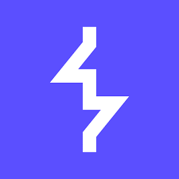

  <samp>
Hello, I'm <a href="https://nerd.az/wp-content/uploads/2020/07/21888938.gif" target="_blank">goblen22</a>. I'm a Russian student of Information Security 🇷🇺. I very much love a pentest and want to become the best in this way.

 

**Languages and Tools:**
  
<code></code>
<code></code>
<code></code>
<code></code>
<code></code>
<code></code>
<code></code>

**Tools of pentesting:**

<code></code>
<code></code>
<code></code>
<code></code>
<code></code>
<code></code>
<code></code>
<code></code>
<code></code>

